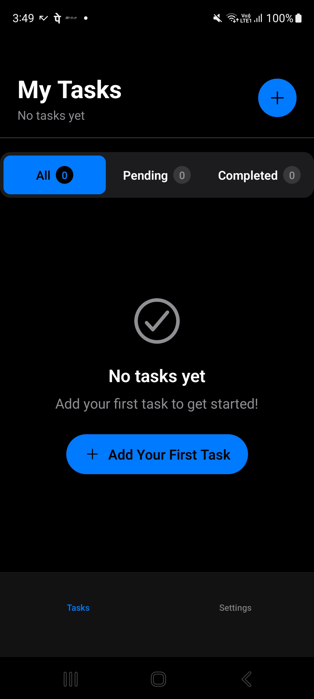
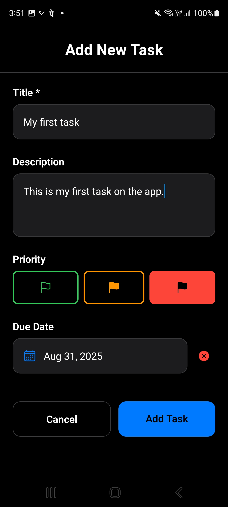
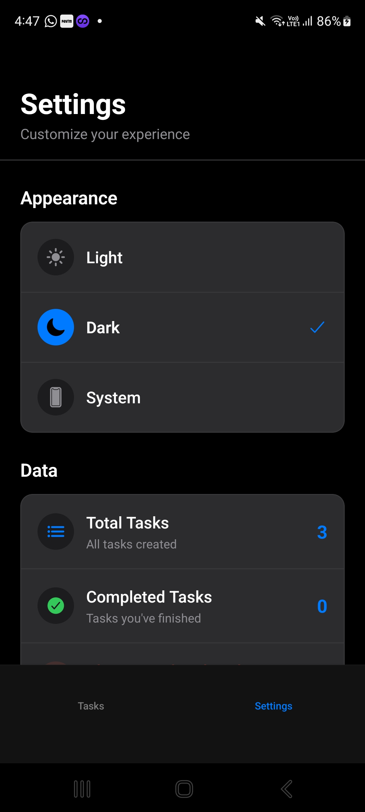
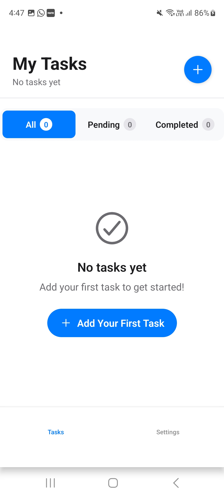
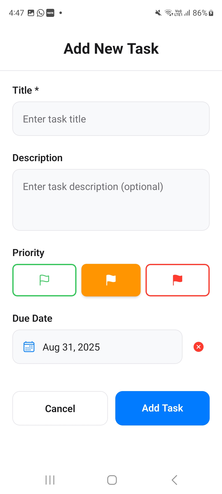

# 📝 To-Do App

A modern, feature-rich task management application built with React Native and Expo. Stay organized and productive with intelligent task scheduling, recurring tasks, and a beautiful, intuitive interface.



## ✨ Features

### 🏷️ Task Management
- **Create & Edit Tasks**: Add titles, descriptions, and detailed information
- **Priority Levels**: Set tasks as Low, Medium, or High priority with visual indicators
- **Due Dates**: Set deadlines with an intuitive date picker
- **Task Completion**: Mark tasks as complete with visual feedback

### 🔄 Recurring Tasks
- **Flexible Recurrence**: Daily, weekly, monthly, or custom intervals
- **Smart Scheduling**: Automatically creates next occurrence when tasks are completed
- **End Date Support**: Set when recurring tasks should stop
- **Custom Intervals**: Define your own recurrence patterns (every X days)

### 🔔 Reminders
- **Time-Based Reminders**: Set specific times for task notifications
- **Toggle Reminders**: Enable/disable reminders per task

### 🎨 User Experience
- **Dark/Light Theme**: Automatic theme switching based on system preferences
- **Intuitive UI**: Clean, modern interface with smooth animations
- **Responsive Design**: Optimized for both portrait and landscape orientations
- **Safe Area Support**: Proper handling of device notches and navigation bars

### 📱 Cross-Platform
- **iOS & Android**: Native performance on both platforms
- **Web Support**: Run in any modern web browser
- **Expo Powered**: Easy development and deployment

## 📸 Screenshots

### Task Management

*Main task list with priority indicators and due dates*


*Create new tasks with all available options*

### Recurring Tasks

*Configure recurring tasks with custom intervals*


*View detailed task information including recurrence*

### Settings & Themes

*App settings and theme preferences*

## 🚀 Getting Started

### Prerequisites
- Node.js (v18 or later)
- npm or yarn
- Expo CLI
- For mobile development:
  - iOS: Xcode (macOS only)
  - Android: Android Studio

### Installation

1. **Clone the repository**
   ```bash
   git clone https://github.com/AkashBadhe/to-do.git
   cd to-do
   ```

2. **Install dependencies**
   ```bash
   npm install
   ```

3. **Install Expo CLI (if not already installed)**
   ```bash
   npm install -g @expo/cli
   ```

### Running the App

#### Development Mode
```bash
npm start
# or
npx expo start
```

This will start the Expo development server. You can then:
- Press `i` to open iOS simulator
- Press `a` to open Android emulator
- Press `w` to open web browser
- Scan QR code with Expo Go app on your phone

#### Production Build
```bash
# For Android APK
npx expo build:android

# For iOS (requires Apple Developer account)
npx expo build:ios
```

## 📖 Usage Guide

### Creating Your First Task
1. Tap the "+" button or "Add Task" in the main screen
2. Enter a title and optional description
3. Set priority level (Low/Medium/High)
4. Add a due date using the date picker
5. Optionally enable recurrence and set frequency
6. Set reminder time if needed
7. Tap "Add Task" to save

### Managing Recurring Tasks
1. When creating a task, toggle "Repeat" switch
2. Choose frequency: Daily, Weekly, Monthly, or Custom
3. For custom intervals, specify number of days
4. Set end date to limit recurrence (optional)
5. When you complete a recurring task, the next occurrence is automatically created

### Organizing Tasks
- Tasks are automatically sorted by due date, priority, and creation time
- Use the filter tabs to view All, Pending, or Completed tasks
- Swipe or use edit button to modify existing tasks

### Theme Settings
- The app automatically follows your system's theme preference
- You can manually switch between light and dark modes in settings

## 🏗️ Project Structure

```
to-do/
├── app/                    # Main application screens (Expo Router)
│   ├── _layout.tsx        # Root layout
│   ├── index.tsx          # Main task list
│   ├── add-todo.tsx       # Add/edit task screen
│   └── (tabs)/            # Tab navigation
├── components/            # Reusable UI components
│   ├── TodoForm.tsx      # Task creation/editing form
│   ├── TodoItem.tsx      # Individual task display
│   └── ui/               # UI primitives
├── constants/            # App constants and themes
├── hooks/                # Custom React hooks
│   ├── useTodos.ts      # Task management logic
│   └── ThemeContext.tsx # Theme management
├── services/            # Data persistence
│   └── StorageService.ts # AsyncStorage wrapper
├── types/               # TypeScript type definitions
│   └── Todo.ts          # Task data models
└── assets/              # Static assets
    ├── images/          # Icons and graphics
    └── screenshots/     # App screenshots
```

## 🛠️ Technologies Used

- **React Native**: Cross-platform mobile development
- **Expo**: Development platform and build service
- **TypeScript**: Type-safe JavaScript
- **Expo Router**: File-based routing
- **AsyncStorage**: Local data persistence
- **React Navigation**: Navigation between screens
- **Ionicons**: Icon library
- **React Native Safe Area Context**: Safe area handling

## 🤝 Contributing

We welcome contributions! Please follow these steps:

1. Fork the repository
2. Create a feature branch: `git checkout -b feature/your-feature-name`
3. Make your changes and test thoroughly
4. Commit your changes: `git commit -m 'Add some feature'`
5. Push to the branch: `git push origin feature/your-feature-name`
6. Open a Pull Request

### Development Guidelines
- Follow TypeScript best practices
- Test on both iOS and Android
- Ensure proper error handling
- Maintain consistent code style
- Update documentation for new features

## 📄 License

This project is licensed under the MIT License - see the [LICENSE](LICENSE) file for details.

## 🙋‍♂️ Support

If you have any questions or need help:

- Create an issue on GitHub
- Check the [Expo documentation](https://docs.expo.dev/)
- Join the [Expo Discord community](https://chat.expo.dev/)

---

**Happy task managing! 🎯**
